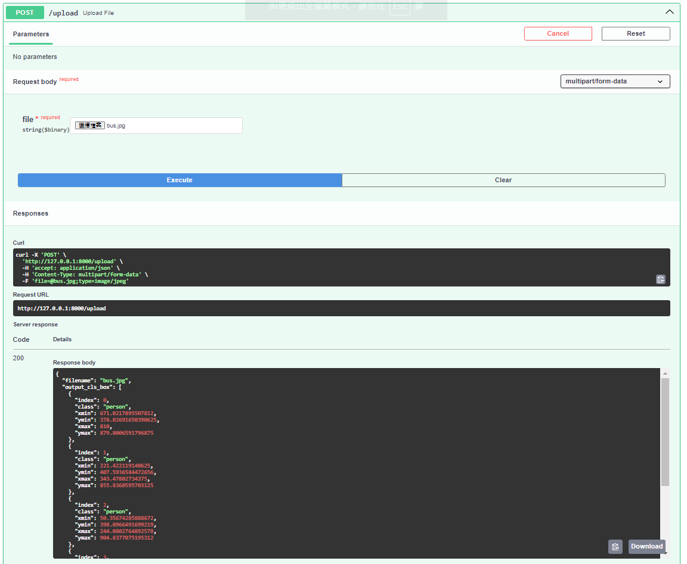

# FastAPI YOLO Object Detection

This application uses FastAPI framework and YOLO model for object detection.

## How to Use

1. Clone this repository:

   ```bash
   git clone https://github.com/jason0860907/fastapi_yolo
   ```

2. Navigate into the directory:

   ```bash
   cd fastapi_yolo
   ```

3. Install dependencies:

   ```bash
   pip install fastapi
   pip install ultralytics
   pip install io
   ```

4. Run the application:

   ```bash
   uvicorn fastapi_test:app --reload
   ```

5. (Option) Upload an image using HTTP POST request to the `/upload` route. Example:

   ```bash
   curl -X 'POST' \
     'http://localhost:8000/upload' \
     -F 'file=@/path/to/your/image.jpg'
   ```

6. (Option) Upload an image using Swagger UI

     - Open your web browser and go to http://localhost:8000/docs. This will open SwaggerUI, which provides a graphical interface for interacting with the API.

     - Click on the /upload endpoint to expand it.

     - Click on the "Try it out" -> "Choose File" -> "Execute" and see the detection results.

7. Detection Results
      - After uploading an image using the /upload endpoint, the application performs object detection using the YOLO ONNX model. The detected objects along with their bounding boxes are returned as a JSON object in the response.
      - Each detected object is represented by its class label and the coordinates of its bounding box (xmin, ymin, xmax, ymax).
      - 
      - Example
        ```bash
         - {  "filename": "bus.jpg",
              "output_cls_box": [
                {
                  "index": 0,
                  "class": "person",
                  "xmin": 671.0217895507812,   # bounding box left
                  "ymin": 378.02691650390625,  # bounding box top
                  "xmax": 810,                 # bounding box right
                  "ymax": 879.8006591796875    # bounding box bottom
                },
                {
                  "index": 1,
                  "class": "person",
                  "xmin": 221.422119140625,   # bounding box left
                  "ymin": 407.5936584472656,  # bounding box top
                  "xmax": 343.47802734375,    # bounding box right
                  "ymax": 855.8360595703125   # bounding box bottom
                }]
           }
         ```
## Notes

- Make sure to install the required Python libraries and YOLO model file `yolov8n.onnx`.
